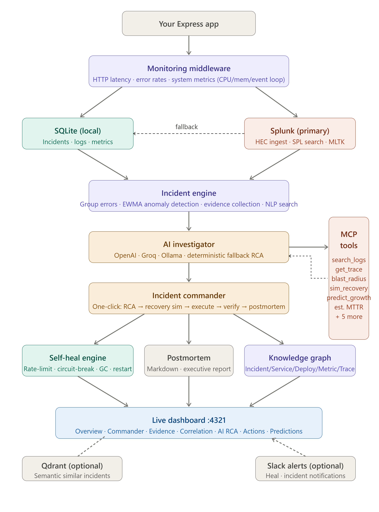

# LogPilot - Splunk-First Incident Commander

LogPilot turns Splunk from a passive log store into the source of truth for an
autonomous incident response workflow.

It is a drop-in Node.js/Express middleware that sends application telemetry to
Splunk through HEC, searches it back through SPL, investigates incidents with an
agentic tool loop, recommends recovery actions, verifies recovery, and produces
executive postmortems from the same Splunk-backed evidence.

**Hackathon thesis:** Splunk should not be the place engineers check after an
incident. Splunk should be the live operating system for incident response.



---

## Why This Wins

| Judging area | What LogPilot proves |
|---|---|
| Splunk-first architecture | Splunk HEC ingests requests, errors, metrics, incidents, heal actions, RCA, recovery checks, and postmortems. SPL search is used as the primary evidence source. |
| Practical impact | Converts noisy service failures into one-click investigation, recovery recommendation, verification, and postmortem generation. |
| Technical depth | HEC batching, SPL search, Splunk-backed datastore, agentic MCP tools, correlation graph, similarity search, forecast SPL, heal rules, and recovery confidence scoring. |
| Demo quality | Works with real Splunk, but degrades to SQLite fallback so the dashboard remains live even if Splunk is unreachable during judging. |
| Operational usefulness | Gives engineers incident timelines, blast radius, MTTR estimate, similar incidents, root cause hypotheses, recovery actions, and executive summaries. |

---

## The Problem

Incident response usually looks like this:

1. An alert fires.
2. Engineers jump between dashboards, logs, terminals, runbooks, and chat.
3. Evidence is copied manually.
4. Recovery is guessed from memory.
5. Postmortems are written after context is already lost.

LogPilot collapses that workflow into a Splunk-centered command surface.

---

## The Solution

LogPilot runs this lifecycle from the dashboard:

```text
Detect -> Ingest to Splunk -> Search Evidence -> Correlate -> Investigate
-> Recommend Recovery -> Simulate -> Execute/Dry Run -> Verify -> Postmortem
```

Everything important is either written to Splunk or searched from Splunk:

| Event type | Sent to Splunk via HEC | Used later by SPL search |
|---|---:|---:|
| HTTP requests | yes | yes |
| Errors | yes | yes |
| CPU/memory/event-loop metrics | yes | yes |
| Incident groups | yes | yes |
| Anomalies | yes | yes |
| Heal actions | yes | yes |
| RCA output | yes | yes |
| Recovery verification | yes | yes |
| Postmortem metadata | yes | yes |

---

## Core Features

| Feature | Why it matters |
|---|---|
| Splunk HEC ingestion | Every app event becomes searchable operational evidence. |
| Splunk Search API integration | Incidents, evidence, analytics, forecasts, and historical matches are read from Splunk first. |
| Incident Commander | One click runs evidence collection, RCA, recovery recommendation, verification, and postmortem. |
| 11 Splunk MCP tools | The AI investigator can search logs, deployments, traces, metrics, heals, blast radius, MTTR, growth, and failure patterns. |
| Correlation graph | Connects incidents to logs, metrics, deployments, heal actions, and related incidents. |
| Similar incident search | Finds historical incidents by path, root cause, and TF-IDF similarity. |
| Recovery simulation | Scores a proposed recovery before execution. |
| Recovery verification | Checks whether the incident actually resolved after action. |
| Executive postmortem | Produces a judge-ready incident narrative from evidence. |
| Local fallback | Demo remains functional without a live Splunk dependency. |

---

## Splunk Integration

LogPilot uses two Splunk paths:

### 1. HEC: send evidence to Splunk

```text
LogPilot -> Splunk HTTP Event Collector -> index=logpilot
```

Default HEC endpoint:

```text
https://localhost:8088/services/collector
```

### 2. Search API: read evidence from Splunk

```text
LogPilot -> Splunk REST Search API -> SPL queries -> dashboard/commander/AI tools
```

Default Search endpoint:

```text
https://localhost:8089/services/search/jobs/export
```

Local Splunk commonly uses a self-signed certificate. For local judging/demo
set:

```env
SPLUNK_REJECT_TLS=false
```

Production hosts verify TLS by default.

---

## Quick Start

### Install

```bash
npm install
```

### Run the demo app

```bash
npm run demo
```

Open:

```text
http://localhost:4321
```

The demo app generates traffic, failures, incidents, metrics, heal actions, and
dashboard updates.

---

## Minimal App Integration

```js
const express = require('express');
const logpilot = require('logpilot');

const app = express();

// Important: initialize before registering routes.
logpilot.init({
  app,
  healEnabled: true,
});

app.get('/api/orders', (req, res) => {
  res.json({ ok: true });
});

app.listen(3000);
```

---

## Splunk Configuration

Create `logpilot.config.js` or pass the same object to `logpilot.init()`.

```js
module.exports = {
  splunk: {
    enabled: true,

    // HEC ingestion
    hecUrl: process.env.SPLUNK_HEC_URL || 'https://localhost:8088',
    token: process.env.SPLUNK_HEC_TOKEN,
    index: process.env.SPLUNK_INDEX || 'logpilot',

    // Search API
    host: process.env.SPLUNK_HOST || 'localhost',
    port: process.env.SPLUNK_PORT || 8089,
    protocol: process.env.SPLUNK_PROTOCOL || 'https',
    username: process.env.SPLUNK_USERNAME,
    password: process.env.SPLUNK_PASSWORD,

    // Optional bearer token for Splunk REST search instead of username/password.
    searchToken: process.env.SPLUNK_TOKEN,

    // Useful for local Docker Splunk with self-signed certs.
    rejectUnauthorized: process.env.SPLUNK_REJECT_TLS !== 'false',
  },

  ai: {
    provider: 'openai', // also supports groq and ollama
    apiKey: process.env.OPENAI_API_KEY,
  },

  mcp: {
    enabled: true,
    maxToolRounds: 3,
  },

  commander: {
    executeRecovery: false, // dry-run by default for safe demos
  },
};
```

Environment variables:

```env
SPLUNK_ENABLED=true
SPLUNK_HOST=localhost
SPLUNK_PORT=8089
SPLUNK_PROTOCOL=https
SPLUNK_HEC_URL=https://localhost:8088
SPLUNK_HEC_TOKEN=your-hec-token
SPLUNK_USERNAME=admin
SPLUNK_PASSWORD=your-password
SPLUNK_INDEX=logpilot
SPLUNK_REJECT_TLS=false
```

---

## What To Demo To Judges

### 1. Open the dashboard

```text
http://localhost:4321
```

Show that traffic, logs, metrics, incidents, and heal actions appear live.

### 2. Open Splunk health

Show:

- HEC status
- queue size
- dropped events
- last success
- Search API status
- configured index

This proves both write and read paths are working.

### 3. Trigger or select an incident

Open an incident modal and show:

- timeline
- evidence
- metrics
- related incidents
- heal history
- correlation graph

### 4. Run Incident Commander

Click the Commander tab.

The pipeline runs:

```text
Evidence -> MCP investigation -> timeline -> correlation -> similar incidents
-> RCA -> recommendation -> simulation -> recovery verification -> postmortem
```

### 5. Show SPL-backed analytics

Open the Splunk page and run observability or forecast queries:

```spl
index=logpilot sourcetype=logpilot:request
| timechart span=1m avg(responseTime) as responseTime
| predict responseTime future_timespan=10
```

This proves LogPilot is not replacing Splunk. It is building an operations
workflow on top of Splunk.

---

## Splunk MCP Tools

The AI investigator can call these tools during incident analysis:

| Tool | Purpose |
|---|---|
| `search_logs` | Search Splunk logs for failure evidence. |
| `find_deployments` | Find deployment events near the incident window. |
| `find_related_incidents` | Find historical incidents by path/root cause. |
| `get_trace` | Pull trace/span evidence. |
| `get_metric_history` | Retrieve CPU, memory, latency, and event-loop history. |
| `get_heal_history` | Check which recovery actions worked before. |
| `simulate_recovery` | Estimate impact and risk before taking action. |
| `estimate_blast_radius` | Estimate affected endpoints/services/users. |
| `predict_incident_growth` | Detect whether the incident is accelerating. |
| `estimate_mttr` | Estimate recovery time from history. |
| `explain_failure_pattern` | Summarize the recurring failure signature. |

---

## System Architecture

```text
Express App
   |
   v
LogPilot Middleware
   |
   +--> SQLite fallback store
   |
   +--> Splunk HEC
          |
          v
      index=logpilot
          |
          v
   Splunk Search API
          |
          v
Dashboard + Incident Commander + AI/MCP Tools
```

Splunk remains the system of record. LogPilot is the agentic response layer.

---

## API Surface For Demo

| Endpoint | Purpose |
|---|---|
| `GET /api/splunk/health` | Verify HEC and Search API health. |
| `GET /api/incidents` | Splunk-first incident list with local fallback. |
| `GET /api/incidents/:id` | Incident details. |
| `GET /api/incidents/:id/evidence` | Evidence bundle. |
| `POST /api/commander/run/:id` | Run full incident lifecycle. |
| `GET /api/observability/queries` | SPL observability and forecast queries. |
| `POST /api/observability/run` | Execute SPL from the dashboard. |
| `POST /api/search` | Natural-language log search. |

---

## Safety And Reliability

- Recovery execution is dry-run by default.
- Local fallback keeps demos alive if Splunk credentials fail.
- HEC has batching, retry, backpressure, health status, and a dead-letter queue.
- Search failures return local evidence instead of crashing the workflow.
- Self-signed local Splunk certificates are supported.
- No Redis, Kubernetes, or external database is required for the demo path.

---

## How To Score This Project

Judges can score the whole project from this README and the live demo:

| Score | Evidence |
|---|---|
| Splunk usage | HEC ingestion, Search API, SPL analytics, Splunk-first datastore, forecast SPL. |
| Innovation | Splunk-backed autonomous incident commander with AI tool use and recovery verification. |
| Completeness | Middleware, dashboard, incident grouping, evidence, RCA, recovery, postmortem, health checks. |
| Real-world value | Reduces incident response time and preserves evidence for postmortems. |
| Demo readiness | One command demo, live dashboard, local fallback, safe dry-run recovery. |

---

## Verification

```bash
npm test
```

Current smoke coverage validates:

- Splunk HEC client behavior
- Splunk search fallback behavior
- Splunk-first incident and metric paths
- MCP tool definitions
- Incident Commander pipeline helpers
- correlation graph
- similar incident search
- dashboard rendering helpers
- recovery and postmortem logic

---

## License

MIT - see [LICENSE](./LICENSE)
